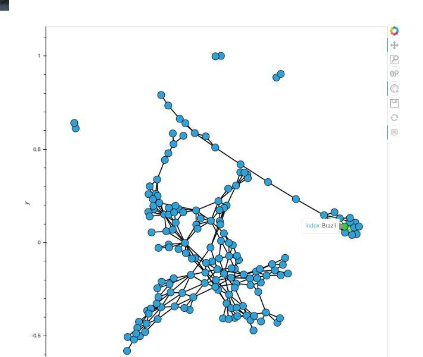
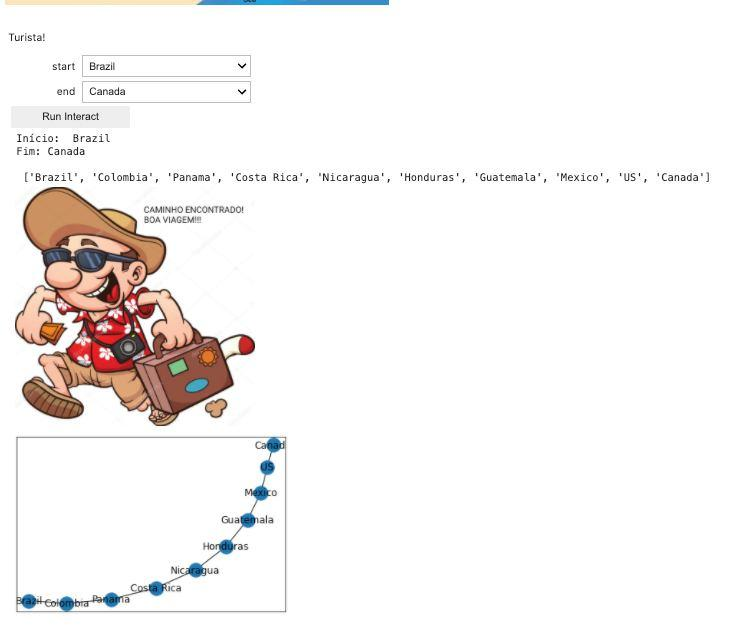
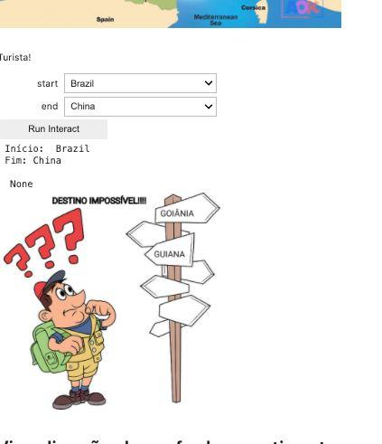

# Turista
# Acesse a aplicação pelo badge! 
# 👇🏽
[](https://mybinder.org/v2/gh/projeto-de-algoritmos/Grafos1_Turista/master?urlpath=%2Fvoila%2Frender%2Fapp.ipynb)

---

**Número da Lista**: 1<br>
**Conteúdo da Disciplina**: Grafos 1<br>

## Alunos
|Matrícula | Aluno |
| -- | -- |
| 17/0138798  |  Caio Fernandes |
| 17/0050939  |  Lucas Dutra    |

## Sobre 
Turista é uma aplicação para quem quer fazer viagens internacionais sem apreciando a paisagem de cada país! Insira o país de origem e o país de destino e descubra a melhor rota para sua viagem!  

## Screenshots
### Grafo total 🙂

### Sucesso na busca 🙂
Países alcançáveis

### Falha na busca ☹️
Países não alcançáveis


## Instalação 
**Linguagem**: Python<br>
É necessário a instalação dos seguintes pacotes: **Python**, **pip** e **virtualenv** (opcional) para instalação do projeto.
### Criação do virtualenv (altamente recomendado)
1. Crie seu ambiente virtual python  
    ```$ virtualenv -p python3 venv ```  
2. Execute o ambiente virtual criado  
    ```$ source venv/bin/activate```  
3. Para desativar o ambiente virtual após execução do projeto   
    ```$ deactivate```
### Execução do projeto
1. Instale as biblioteca necessárias  
    ```$ pip3 install -r requirements.txt```
2. Execute o script de pré-processamento dos dados  
    ```$ python main.py run```
3. Habilite os widget em seu notebook  
    ```$ jupyter nbextension enable --py --user widgetsnbextension```
4. Execute o notebook juntamente com o `voila`  
   ```$ jupyter-notebook --NotebookApp.token="" --VoilaConfiguration.enable_nbextensions=True```


## Uso 

### Vídeo explicativo
[Aqui](https://github.com/projeto-de-algoritmos/Grafos1_Turista/blob/master/app.mp4)

### Para acessar o deploy da aplicação, COM TODOS OS RECURSOS clique no badge abaixo:
[](https://mybinder.org/v2/gh/projeto-de-algoritmos/Grafos1_Turista/master?urlpath=%2Fvoila%2Frender%2Fapp.ipynb)

### Para acessar a interface da aplicação `voila`:
 - Após execução do comando **4.** Acessar:
    `http://localhost:8888/voila/App.ipynb`

### Caso queira consultar o código:
- Após execução do comando **4.** Acessar:
  `http://localhost:8888/tree/Grafos1_Cities.ipynb`

## Outros 
<p>Neste projeto foram utilizadas fontes diferentes de dados, retiradas do <a href="https://www.kaggle.com/">kaggle</a>. A <a href="https://www.kaggle.com/resheto/country-borders">primeira</a>, consistia em, basicamente, a maioria dos países de todos os continentes associados às suas fronteiras. A <a href="https://www.kaggle.com/tomvebrcz/countriesandcontinents">segunda</a>, possui a lista da maioria dos países associada aos respectivos continentes.</p>

<p>Porém, ambos os dados apresentavam algumas incosistências como repetição desnecessária de variáveis e padrões nominais desatualizados. Para otimização da utilidade dessas fontes, foi necessário a aplicação de técnicas de pré-processamento, usando como suporte a biblioteca de manipulação de dados <a href="https://pandas.pydata.org/">pandas</a> e, também, a biblioteca <a href="https://metaflow.org/">Metaflow</a>, originalmente desenvolvida na Netflix para aumentar a produtividade dos cientistas de dados que trabalham em uma grande variedade de projetos, desde estatísticas clássicas até state-of-the-art deep learning.</p>

<p>Além disso, criamos um novo dataset, proveniente do cruzamento de dados de ambas a fontes citadas anteriormente.</p>
